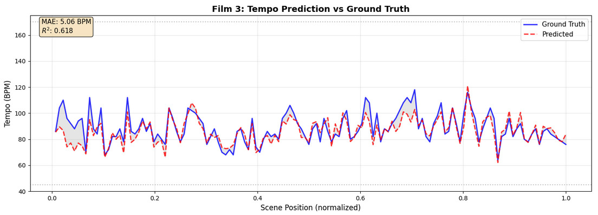
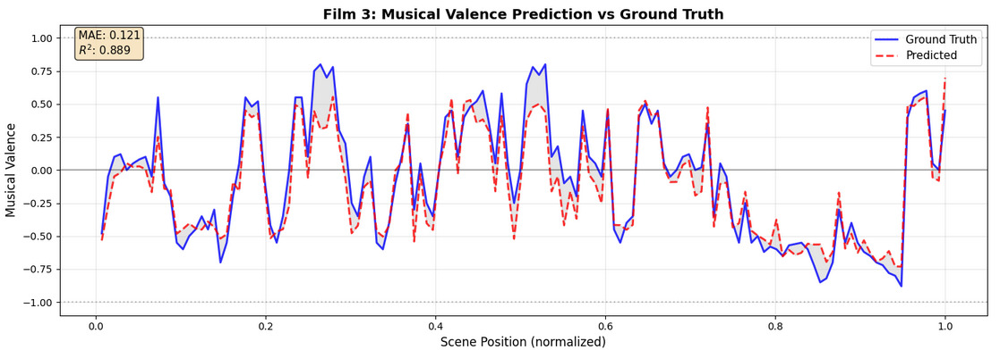

# 🎬 CineEmotion: Multi-Stage Cascading Architecture for Film Music Description

<div align="center">

[](https://www.python.org/)
[](https://pytorch.org/)
[](https://huggingface.co/transformers/)
[](https://huggingface.co/)
[](#license)

> **From Scene Text to Orchestration** — Predicting film music descriptors from raw screenplay text using a three-stage cascading neural pipeline.

🚀 **[Try the Live Demo](https://huggingface.co/spaces/suyashnpande/CineEmotion)**

</div>

---

## 📑 Table of Contents

- [Overview](#overview)
- [Key Features](#key-features)
- [Quick Start](#quick-start)
- [Pipeline Architecture](#pipeline-architecture)
- [Performance Results](#performance-results)
- [Repository Structure](#repository-structure)
- [Dataset](#dataset)
- [Installation](#installation)
- [Inference](#inference)
- [Contributing](#contributing)
- [License](#license)

---

## 🎯 Overview

CineEmotion processes raw screenplay scenes through three progressively sophisticated modules to predict concrete music parameters including **tempo, tonality, harmonic style, dynamics, rhythm, texture, and orchestration** — all from text alone.

Evaluated on **81 annotated films** (~11,000 scenes), CineEmotion achieves:
- 🎵 **Tempo prediction**: R² = **0.842** (MAE = 7.28 BPM)
- 😊 **Musical valence**: R² = **0.863**
- 🎹 **Tonality classification**: **86.1% accuracy**

---

## ✨ Key Features

- **End-to-End Pipeline**: From raw screenplay text to detailed music descriptions
- **Multi-Modal Analysis**: Processes emotional, narrative, and contextual information
- **Pre-trained Models**: All checkpoints available on HuggingFace Hub
- **High Accuracy**: State-of-the-art performance on film music prediction
- **Easy Inference**: Simple notebook-based interface for predictions
- **Production Ready**: Deployed on HuggingFace Spaces

---

## 🚀 Quick Start

### 1. Installation

```bash
pip install torch transformers huggingface_hub scikit-learn numpy
```

### 2. Run Inference

```python
# Load the inference notebook and provide your screenplay scenes
scenes = [
    {
        "scene_id": 1,
        "scene_header": "EXT. RAINFOREST - DAY",
        "scene_text": "EXT. RAINFOREST - DAY\nThe sun's rays shaft down through the canopy..."
    }
]

# Run inference.ipynb to get predictions:
# - Tempo in BPM
# - Musical valence (-1 to +1)
# - Tonality (major/minor/atonal)
# - Orchestration (strings, brass, percussion, etc.)
```

### 3. Online Demo

Visit our live demo on HuggingFace Spaces: **[CineEmotion Space](https://huggingface.co/spaces/suyashnpande/CineEmotion)**

---

## 🏗️ Pipeline Architecture

The CineEmotion system consists of three cascading modules:

```
Raw Screenplay Text
        ↓
┌───────────────────────────────────┐
│  Module 1: Scene Perception       │
│  - Emotional valence              │
│  - Conflict & tension analysis    │
│  - Acoustic space classification  │
└───────────────────────────────────┘
        ↓ (256-d embedding + 11 predictions)
┌───────────────────────────────────┐
│  Module 2: Narrative Context      │
│  - Tension & arousal levels       │
│  - Narrative arc position         │
│  - Foreshadowing detection        │
└───────────────────────────────────┘
        ↓ (256-d context vector + 6 predictions)
┌───────────────────────────────────┐
│  Module 3: Music Descriptor       │
│  - Tempo, valence, tonality       │
│  - Orchestration prediction       │
│  - Dynamic & rhythm styles        │
└───────────────────────────────────┘
        ↓
Music Descriptors Output
```

### Repository Structure

```
CineEmotion/
├── final-module1.ipynb           # Module 1 — Scene Perception (training + evaluation)
├── final-module2.ipynb           # Module 2 — Narrative Context (training + evaluation)
├── final-module3.ipynb           # Module 3 — Music Descriptor Prediction (training + evaluation)
├── inference.ipynb               # End-to-end inference on new screenplay scenes
├── readme_images/                # Visualizations and charts
│   ├── Tempo-graph.jpeg
│   └── Musical-Valence-chart.jpeg
└── README.md
```

---

## 📊 Module 1 — Scene Perception

**File**: `final-module1.ipynb`

- **Backbone**: `distilroberta-base` (768-d), fine-tuned on screenplay text
- **Input**: Raw scene text (max 512 tokens)
- **Output**: 256-d scene embedding + 11 multi-task predictions

| Head | Type | Output Classes/Range |
|---|---|---|
| emotional_valence | 4-class | Positive / Neutral / Tension / Negative |
| conflict_nature | 6-class | Physical / Psychological / Interpersonal / ... |
| acoustic_space | 6-class | Interior_Small / Outdoor_Natural / ... |
| reality_layer | 5-class | Present / Memory / Dream / ... |
| score_dynamic_shape | 4-class | Build_Release / Sustained / ... |
| scene_interaction_tone | 5-class | Conflict / Bonding / Expository / ... |
| pacing_intensity | Regression | 1–10 |
| action_intensity | Regression | 0–10 |
| scene_tension_raw | Regression | 1–10 |
| scene_arousal | Regression | 0–1 |
| emotion_tags | 7-label multilabel | Anger / Joy / Sadness / Fear / ... |

**Results**:

| Head | Accuracy | F1-Macro | Notes |
|---|---|---|---|
| emotional_valence | 0.559 | 0.510 | - |
| acoustic_space | **0.767** | **0.612** | Best performing head |
| scene_interaction_tone | 0.568 | 0.428 | - |
| pacing_intensity | MAE=1.02 | R²=0.557 | Regression task |
| action_intensity | MAE=1.25 | R²=0.603 | Regression task |

---

## 📈 Module 2 — Narrative Context

**File**: `final-module2.ipynb`

- **Architecture**: 4-layer, 8-head Pre-LN Transformer Encoder
- **Input**: 5-scene sliding window of 304-d feature vectors from Module 1
- **Output**: 256-d context vector + 6 predictions

Captures narrative dynamics and how scenes relate to the broader story arc.

| Head | Type | Output Classes/Range |
|---|---|---|
| tension_level | Regression | 1–10 |
| arousal_level | Regression | 1–10 |
| emotional_shift_trigger | Binary | True / False |
| narrative_arc_position | 5-class | Setup / Rising / Climax / Falling / Resolution |
| foreshadowing_type | 4-class | None / Foreshadow / Payoff / Echo |
| transition_type | 5-class | attacca / fade / segue / silence / cut |

**Results**:

| Head | Score |
|---|---|
| tension_level | MAE=1.21, R²=0.565 |
| arousal_level | MAE=1.20, R²=0.559 |
| emotional_shift (F1) | 0.524 (recall=0.729) |
| narrative_arc (Accuracy) | **0.605** |

---

## 🎵 Module 3 — Music Descriptor Prediction

**File**: `final-module3.ipynb`

- **Architecture**: MLP on 314-d input (41-d M1 labels + 16-d M2 labels + 256-d context vector)
- **Input**: Ground truth M1/M2 labels during training; predicted labels at inference
- **Output**: 8 music descriptor predictions with confidence scores

| Head | Type | Output |
|---|---|---|
| tempo_bpm | Regression | 45–170 BPM |
| musical_valence | Regression | −1.0 to +1.0 |
| tonality | 3-class | atonal / major / minor |
| harmonic_style | 7-class | chromatic / diatonic / modal / ... |
| dynamic_shape_m4 | 8-class | crescendo / sustained / swell / ... |
| rhythm_style | 6-class | drive / pulse / rubato / sparse / ... |
| texture | 5-class | ambient / chamber / full / hybrid / solo |
| orchestration | 14-label multilabel | strings / percussion / piano / brass / ... |

---

## 📊 Performance Results

### Module 3 — Final Performance


*Figure 1: Tempo prediction performance across validation set (R² = 0.842)*

| Head | Score | Performance |
|---|---|---|
| tempo_bpm | MAE=7.28, **R²=0.842** | 🟢 Excellent |
| musical_valence | MAE=0.128, **R²=0.863** | 🟢 Excellent |
| tonality | **Acc=0.861**, F1-Mac=0.714 | 🟢 Strong |
| dynamic_shape_m4 | Acc=0.774, F1-Mac=0.607 | 🟡 Good |
| orchestration | F1-Mac=0.274, F1-Wt=0.629 | 🟡 Moderate |


*Figure 2: Musical valence prediction distribution and model calibration*

---

## 🤖 Pretrained Models

All checkpoints are publicly available on HuggingFace Hub:

| Module | Task | Model Card | Parameters |
|---|---|---|---|
| **M1** | Scene Perception | [suyashnpande/scene-perception-m1-harshal](https://huggingface.co/suyashnpande/scene-perception-m1-harshal) | 67M |
| **M2** | Narrative Context | [suyashnpande/narrative-context-m2-harshal](https://huggingface.co/suyashnpande/narrative-context-m2-harshal) | 12M |
| **M3** | Music Descriptors | [suyashnpande/music-descriptor-m3](https://huggingface.co/suyashnpande/music-descriptor-m3) | 2M |

---

## 📚 Dataset

### Primary Dataset (Internal)

- **81 annotated films** with diverse genres and styles
- **~11,120 scenes** with comprehensive annotations
- **Multi-level annotations**: M1, M2, and M3 labels for each scene
- **Split**: 64 train / 8 validation / 8 test films (film-level, seed=42)
- **LLM-Generated Screenplays**: Synthetic screenplay scenes created using advanced language models
- **Rich Annotations**: Emotional, narrative, and musical attributes for each scene

📊 **Access the dataset on Kaggle**: [Extended Movie Dataset](https://www.kaggle.com/datasets/donbosoc/extended-movie-dataset)

---

## ⚙️ Installation

### Prerequisites

- Python 3.8+
- CUDA 11.0+ (recommended for GPU inference)
- 8GB+ RAM (16GB recommended)

### Setup

```bash
# Clone the repository
git clone https://github.com/suyashnpande/Context-Aware-Background-Music-Descriptor-Generation-from-Movie-Scripts
```


---

## 🎬 Inference

### Option 1: Using the Inference Notebook 

Open `inference.ipynb` in Jupyter and follow these steps:

1. **Prepare your screenplay scenes** in the following format:

```python
scenes = [
    {
        "scene_id": 1,
        "scene_header": "EXT. RAINFOREST - DAY",
        "scene_text": "EXT. RAINFOREST - DAY\nThe sun's rays shaft down through the dense canopy, illuminating a misty world of vegetation..."
    },
    {
        "scene_id": 2,
        "scene_header": "INT. LINK ROOM",
        "scene_text": "INT. LINK ROOM\nJake sits in a chair, talking straight to camera. His eyes are intense, concerned..."
    }
]
```

2. **Run the notebook cells** in order:
   - Cell 1: Downloads M1 checkpoint from HuggingFace → runs scene perception
   - Cell 2: Downloads M2 checkpoint from HuggingFace → runs narrative context
   - Cell 3: Downloads M3 checkpoint from HuggingFace → predicts music descriptors
   - Cell 4: Prints per-scene music predictions in a detailed output format

3. **Expected Output**:

```
🎵 MUSIC DESCRIPTORS
━━━━━━━━━━━━━━━━━━━━━━━━━━━━━━━━━━━━━━━━━━━━━━━━━━━━━━━━━

Tempo                    93.6 BPM
Valence                  -0.111
Tonality                 minor
Harmonic                 diatonic
Dynamic                  sustained
Rhythm                   pulse
Texture                  chamber

🎼 ORCHESTRATION (Confidence Scores)
━━━━━━━━━━━━━━━━━━━━━━━━━━━━━━━━━━━━━━━━━━━━━━━━━━━━━━━━━

Strings          0.69
Piano            0.57
Woodwinds        0.37
Ambient_pad      0.30
Guitar           0.30
Percussion       0.24
Synth            0.20
Brass            0.13
```

**For Multiple Scenes** - Output is generated for each scene with music descriptor predictions and confidence-weighted orchestration recommendations.

### Option 2: Using Kaggle (Pre-configured Environment)

All notebooks are designed to run on **Kaggle with GPU** enabled:

1. Upload notebooks to Kaggle dataset
2. Set HuggingFace tokens as Kaggle Secrets:
   - `HF_READ_TOKEN`
   - `HF_WRITE_TOKEN`
3. Run with GPU acceleration for faster inference


### FAQ

**Q: Can I use this for non-English screenplays?**  
A: The models are trained on English screenplays. For other languages, you may need to fine-tune.

---

## 📄 License

This project is licensed under the MIT License — see [LICENSE](LICENSE) file for details.

---

## 🔗 Links

- 📦 **HuggingFace Hub**: [Models Repository](https://huggingface.co/suyashnpande)
- 🚀 **Live Demo**: [CineEmotion Space](https://huggingface.co/spaces/suyashnpande/CineEmotion)
- 📊 **Research Report**: `FINAL_INLP_Report.pdf`
- 📈 **Project Slides**: `INLP_BUTTER-NON_PPT.pdf`

---

## 👥 Authors

- **Suyash Pande**
- **Shivam Patel**
- **Harshal Karangale**
---

## ⭐ Acknowledgments

- IIIT Hyderabad, Sem 2 INLP Project
- HuggingFace Community

---

**Last Updated**: May 2024  
**Repository**: [GitHub](https://github.com/suyashnpande/Context-Aware-Background-Music-Descriptor-Generation-from-Movie-Scripts)


